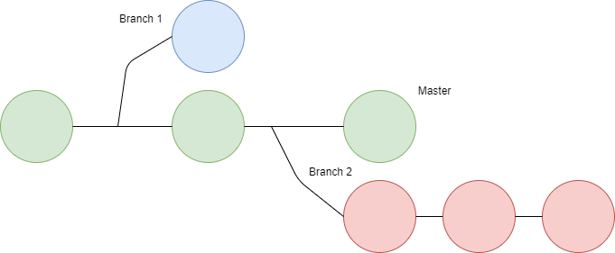

# 學習 Git 版本控制，持續更新
## 項目
- [建立版本管理庫](#建立版本管理庫)
- [記錄操作](#記錄操作)
- [提交返回](#提交返回)
- [分支](#分支)
- [遠端操作](#遠端合作)
- [參考](#參考)
## 建立版本管理庫
* 設定個人資訊(config)
    * 每次在commit都會記錄作者訊息(Name與Email)

        `git config --global user.name "你的名字"`

        `git config --global user.email "你的Mail"`
    * 查看個人設定

        `git config --global --list`
* 建立版本管理庫(init)

    `git init`
* 新增文件管理(add)
    * 新增文件

        `git add 檔名`
    * 一次新增所有文件

        `git add .`
* 提交變更(commit)

    `git commit -m "變更訊息"`
* 修改變更(amend)

    `git commit --amend -m "變更訊息"`

* 下載Git上的專案(Clone)，專案URL有SSH、HTTP

    `git clone <專案URL>`

## 記錄操作

    每個文件都會有兩種狀態分別是追蹤Tracked和Untracked。Tracked文件，可以是Unmodified、Modified、或Staged(已儲存至版本庫)；Untracked文件，就是不在git紀錄的資料夾內。簡單說Tracked文件是Git知道的文件，Untracked文件則是相反。在編輯文件時，Git會視為Modified，當你下git add指令就會將狀態改變為Staged(已儲存至版本庫)，你提交(commit)修改之後，狀態會再回Unmodified，然後會重複該流程

* 查看記錄(log)

    `git log`

* 查看記錄(log)，加入oneline與graph參數可以印出最簡潔與圖形化結果

    `git log --oneline -graph`
* 查看工作目錄下所有檔案情況，Project、modified、untracked、new file，最後參數s是用最簡潔方式印出結果

    `git status -s`
* 查看尚未add(unstaged)的修改部分

    `git diff`
* 查看已add(staged)，但未commit，在最後加入參數cached

    `git diff --cached`
* 查看unstaged & staged，在最後加入 HEAD

    `git diff HEAD`
## 返回(reset)
* 從staged返回至Modifed

    `git reset <檔名>`
* 從staged返回至Modifed，加入hard參數，HEAD~後數字是要返回到幾個，1 -> 返回前一個HEAD

    `git reset --hard HEAD~<數字>`
* 從staged返回至Modifed，加入hard參數再加入commit ID

    `git reset --hard <提交ID>`

* 查看所有commit資訊

    `git reflog`

## 分支(branch)

    在開發軟體時，可能會有多人合作開發同種功能，所以會有多個軟體版本，而Git分支是用來維護這狀況。簡單來說，主分支Master就是軟體完美穩定的版本要給客戶的，而Branch 2可能是用來開發版本，會將所以開發Commit會放在第一個分支版本以外，而第一個分支版本是繼承主分支Master版本，而主分支Master是不會受影響的，然後開發完成也可以合併到Master成為下個主程式分支版本。

* 建立分支

    `git branch <分支名>`
* 切換分支

    `git checkout <分支名>`
* 刪除分支，加入d參數

    `git branch -d <分支名>`
* 建立&切換分支

    `git checkout -b <分支名>`
* 合併分支

    `git merge -m "合併訊息"`

## 遠端操作(Remote)
    Git利用遠端來進行專案管理(新增或移除遠端版本庫)、將修改推送(push)至遠端版本庫、從遠端版本庫拉取(pull)資料

* 列出遠端版本庫
    
    `git remote -v`
* 新增遠端版本庫
    
    `git remote add <簡稱> <URL>`
* 移除遠端版本庫

    `git remote rm <簡稱>`
* 重新命名遠端

    `git remote rename <舊簡稱> <新簡稱>`
* 從遠端拉取(fetch、pull)，fetch是將遠端版本庫資料拉取下來但不會合併，pull則是會合併，如果有選擇合併哪個分支可以選擇fetch會比較方便
    
    `git fetch`

    `git fetch origin <分支>:<要拉取到放在的分支>`

    `git pull`

## 參考
* Git: https://git-scm.com/
* 莫凡Git 版本管理: https://morvanzhou.github.io/tutorials/others/git/